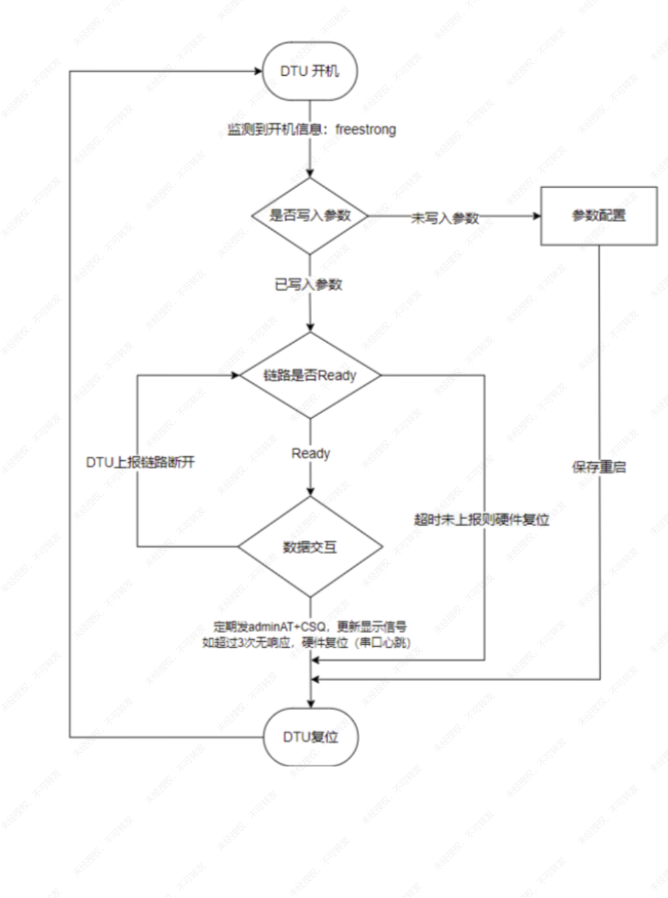
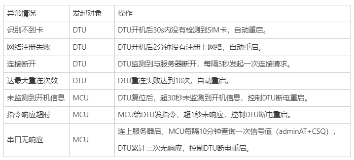
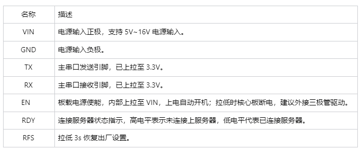
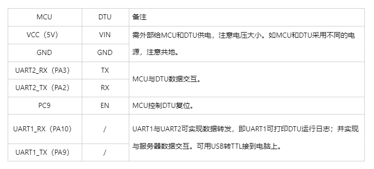

# [ONENET例程说明]
1. 此Demo为ONENET例程。
2. 单片机监测到DTU连上服务器后，数据直接透传；
3. 例程可长时间保持连接并且支持各种异常处理。

# [DTU状态机函数-流程]

1. 监听开机信息：MCU会监听DTU开机上报的信息。
2. 是否写入参数：通过查询DTU参数版本判断是否写入参数，如果未写入则进行参数配置。
3. 是否连接成功：如果未连接成功，MCU将持续监听；连接成功后，MCU开始和服务器进行数据交互。
4. 上报信号值：  定期查询信号值，方便设备端交互界面定期更新信号状态。

## [异常处理机制]

# [目录说明]
.
├── Application/MDK-ARM：驱动DTU需要用到的相关驱动库文件
├── Application/User/core：定时器、串口、引脚初始化、主函数运行
├── STM32F1xx_HAL_Driver：HAL库驱动文件
├── User：用户程序开发入口

# [驱动库文件说明]
./User
├── yundtu：DTU的驱动库，配置参数、异常处理、数据交互等
├── lwrb：实现轻量级环形缓冲区的初始化、读写等操作 

# [移植说明]
1. 例程所使用的是HAL库实现，若移植其它MCU平台需要根据做相应的修改。
2. 只需要移植目录下User文件夹中的相关驱动库文件。
3. 移植后，需要在Options for target配置中的C/C++选项卡勾选C99 Mode，否则程序无法正常编译以及运行。

# [FS800DTU核心板引脚描述]

注：
（1）在本例程中，只使用到了VIN、GND、TX、RX、EN引脚；
（2）核心板在注网时峰值电流可达1.8A，如果前级电源不满足需求，可能出现核心板频繁重启的情况，此时建议外接电源供电。

# [硬件接线说明]

# [注意事项]
1. 例程中的IP地址、端口以及其他连接参数仅供参考，需要根据实际修改。
2. 如果你在例程中修改了参数配置指令，为了能写入DTU，请在yundtu.c中将YUNDTU_PARAMETER_VERSION的值加1.
3. 用户可根据实际需求调整例程中对异常处理的超时时间、次数等。

