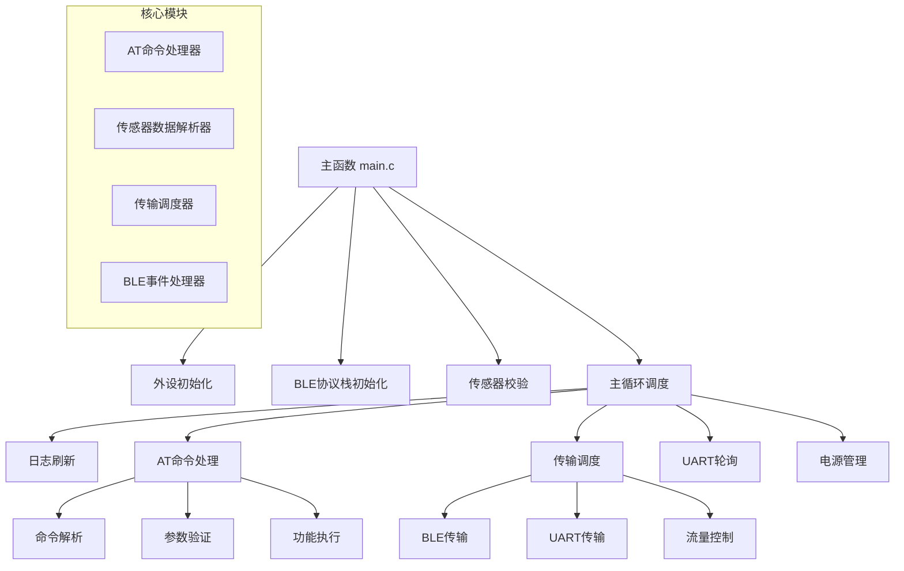

# BLE UART AT命令项目教学文档

## 学习目标

通过本教学文档，您将学会：
1. 理解BLE多角色应用的基本架构
2. 掌握AT命令处理系统的设计原理
3. 学会传感器数据处理和校验机制
4. 理解嵌入式系统的任务调度和电源管理
5. 掌握BLE协议栈的集成和使用方法

## 第一章：项目架构概览

### 1.1 整体架构图



### 1.2 文件结构分析

```
ble_app_uart_at/
├── Src/
│   ├── user/                    # 用户应用层代码
│   │   ├── main.c              # 主程序入口
│   │   ├── user_app.c/h        # BLE应用逻辑
│   │   ├── at_cmd_handler.c/h  # AT命令处理
│   │   ├── sensor_data_parser.c/h  # 传感器数据解析
│   │   ├── transport_scheduler.c/h # 传输调度
│   │   └── uart0_init.c/h      # UART初始化
│   ├── platform/               # 平台相关代码
│   │   └── user_periph_setup.c/h  # 外设配置
│   └── config/                 # 配置文件
│       └── custom_config.h     # 自定义配置
├── GCC/                        # GCC编译配置
├── IAR/                        # IAR编译配置
└── Keil_5/                     # Keil编译配置
```

## 第二章：核心概念学习

### 2.1 BLE基础概念

#### 2.1.1 BLE角色类型
```c
// BLE设备可以扮演的角色
typedef enum {
    BLE_GAP_ROLE_OBSERVER,    // 观察者：只扫描，不连接
    BLE_GAP_ROLE_BROADCASTER, // 广播者：只广播，不连接
    BLE_GAP_ROLE_CENTRAL,     // 中心设备：主动发起连接
    BLE_GAP_ROLE_PERIPHERAL,  // 外围设备：被动接受连接
} ble_gap_role_t;
```

**学习要点**：
- Central（中心设备）：类似于传统蓝牙的主设备，主动扫描和连接
- Peripheral（外围设备）：类似于传统蓝牙的从设备，广播并等待连接
- 一个设备可以同时支持多种角色（多角色）

#### 2.1.2 BLE连接状态机
```c
typedef enum {
    STANDBY     = 0x01,  // 待机：设备空闲状态
    ADVERTISING,         // 广播：作为Peripheral广播自己
    SCANNING,           // 扫描：作为Central扫描其他设备
    INITIATING,         // 发起连接：正在建立连接
    CONNECTED,          // 已连接：与其他设备建立了连接
} dev_state_t;
```

**状态转换图**：
```
STANDBY ←→ ADVERTISING (开始/停止广播)
STANDBY ←→ SCANNING (开始/停止扫描)
SCANNING → INITIATING (发现目标设备)
INITIATING → CONNECTED (连接成功)
CONNECTED → STANDBY (连接断开)
```

### 2.2 AT命令系统

#### 2.2.1 AT命令格式
```
AT+<命令名>[=<参数1>[,<参数2>...]]
```

**示例**：
```
AT+TEST                    # 测试命令，无参数
AT+BAUD=115200            # 设置波特率为115200
AT+ADVPARAM=100,200,0,0   # 设置广播参数
```

#### 2.2.2 命令处理流程
```c
// 1. 接收命令字符串
char cmd_buffer[256];

// 2. 解析命令结构
typedef struct {
    char cmd_name[32];        // 命令名称
    char params[10][64];      // 参数数组
    uint8_t param_count;      // 参数个数
} at_cmd_parse_t;

// 3. 执行对应功能
void execute_at_command(at_cmd_parse_t *cmd);
```

### 2.3 传感器数据处理

#### 2.3.1 数据格式定义
```c
// 传感器数据包含5个字段
typedef struct {
    float concentration;      // 浓度值 (0.0-100.0 %vol)
    float temperature;       // 温度值 (-40.0-85.0 °C)
    uint32_t reserved_field; // 预留字段 (用于扩展)
    uint8_t status_code;     // 状态码 (0=正常, 其他=异常)
    uint8_t checksum;        // 校验码 (用于验证数据完整性)
    bool data_valid;         // 数据有效标志
} sensor_data_t;
```

#### 2.3.2 校验算法
```c
// 简单的校验和算法示例
uint8_t calculate_checksum(const uint8_t *data, uint16_t length) {
    uint8_t checksum = 0;
    for (uint16_t i = 0; i < length - 1; i++) {  // 最后一个字节是校验码本身
        checksum ^= data[i];  // 异或校验
    }
    return checksum;
}
```

## 第三章：代码实现详解

### 3.1 主函数分析

```c
int main(void)
{
    // 第一步：硬件初始化
    app_periph_init();
    
    // 第二步：软件初始化
    ble_stack_init(ble_evt_handler, &heaps_table);
    
    // 第三步：自检测试
    sensor_data_test_checksum();
    
    // 第四步：主循环
    while (1) {
        app_log_flush();        // 任务1：日志处理
        at_cmd_schedule();      // 任务2：命令处理
        transport_schedule();   // 任务3：数据传输
        uart_polling_task();    // 任务4：串口轮询
        pwr_mgmt_schedule();    // 任务5：电源管理
    }
}
```

**学习要点**：
1. **初始化顺序很重要**：硬件 → 软件 → 自检 → 运行
2. **主循环采用轮询方式**：适合简单的实时系统
3. **任务优先级通过顺序体现**：日志最先，电源管理最后

### 3.2 BLE事件处理

```c
void ble_evt_handler(const ble_evt_t *p_evt)
{
    switch (p_evt->evt_id) {
        case BLE_COMMON_EVT_STACK_INIT:
            // 协议栈初始化完成
            ble_app_init();
            break;
            
        case BLE_GAP_EVT_CONNECTED:
            // 设备连接成功
            uart_at_conn_task(p_evt->evt.gap_evt.params.connected.ll_role);
            break;
            
        case BLE_GAP_EVT_DISCONNECTED:
            // 设备连接断开
            codeless_disconn_task(p_evt->evt.gap_evt.index, 
                                 p_evt->evt.gap_evt.params.disconnected.reason);
            break;
            
        case BLE_GAP_EVT_ADV_REPORT:
            // 收到广播报告（扫描时）
            uart_at_adv_report_task(p_evt->evt.gap_evt.params.adv_report.data,
                                   p_evt->evt.gap_evt.params.adv_report.length,
                                   &p_evt->evt.gap_evt.params.adv_report.broadcaster_addr);
            break;
    }
}
```

**学习要点**：
1. **事件驱动编程**：系统通过事件回调处理异步操作
2. **状态同步**：每个事件都会更新相应的系统状态
3. **错误处理**：需要处理各种异常情况

### 3.3 AT命令实现示例

```c
// AT+BAUD=<波特率> 命令实现
void uart_at_baud_set(at_cmd_parse_t *p_cmd_param)
{
    // 1. 参数验证
    if (p_cmd_param->param_count != 1) {
        uart_at_printf("ERROR: Invalid parameter count\r\n");
        return;
    }
    
    // 2. 参数解析
    uint32_t baud_rate = atoi(p_cmd_param->params[0]);
    
    // 3. 参数范围检查
    if (baud_rate < 9600 || baud_rate > 921600) {
        uart_at_printf("ERROR: Baud rate out of range\r\n");
        return;
    }
    
    // 4. 执行设置
    app_uart_deinit(APP_UART_ID);
    app_uart_params_t uart_param = {
        .id = APP_UART_ID,
        .init.baud_rate = baud_rate,
        .init.data_bits = UART_DATABITS_8,
        .init.stop_bits = UART_STOPBITS_1,
        .init.parity = UART_PARITY_NONE,
    };
    app_uart_init(&uart_param, uart_evt_handler);
    
    // 5. 返回结果
    uart_at_printf("OK\r\n");
}
```

**学习要点**：
1. **参数验证**：检查参数个数和有效性
2. **错误处理**：提供清晰的错误信息
3. **原子操作**：确保设置过程的完整性

## 第四章：实践练习

### 4.1 练习1：添加新的AT命令

**任务**：实现一个查询系统运行时间的AT命令 `AT+UPTIME?`

**步骤**：
1. 在 `at_cmd_handler.h` 中声明函数
2. 在 `at_cmd_handler.c` 中实现函数
3. 在命令表中注册新命令
4. 测试命令功能

**参考实现**：
```c
// 1. 添加系统启动时间变量
static uint32_t system_start_time = 0;

// 2. 在初始化时记录启动时间
void system_init(void) {
    system_start_time = app_timer_get_current_time();
}

// 3. 实现查询命令
void uart_at_uptime_get(at_cmd_parse_t *p_cmd_param) {
    uint32_t current_time = app_timer_get_current_time();
    uint32_t uptime_ms = current_time - system_start_time;
    uint32_t uptime_sec = uptime_ms / 1000;
    
    uart_at_printf("+UPTIME:%d seconds\r\n", uptime_sec);
    uart_at_printf("OK\r\n");
}
```

### 4.2 练习2：扩展传感器数据字段

**任务**：在传感器数据中添加湿度字段

**步骤**：
1. 修改 `sensor_data_t` 结构体
2. 更新数据解析函数
3. 修改校验算法
4. 测试新的数据格式

### 4.3 练习3：实现数据过滤功能

**任务**：只有当传感器数值变化超过阈值时才发送数据

**思路**：
1. 保存上次发送的数据
2. 比较当前数据与上次数据的差异
3. 只有差异超过阈值才发送

## 第五章：调试技巧

### 5.1 日志调试

```c
// 使用分级日志
APP_LOG_DEBUG("Debug info: value = %d", value);
APP_LOG_INFO("System started successfully");
APP_LOG_WARNING("Low battery warning");
APP_LOG_ERROR("Communication error occurred");
```

### 5.2 状态监控

```c
// 添加状态查询命令
void uart_at_status_get(at_cmd_parse_t *p_cmd_param) {
    uart_at_printf("+STATUS:\r\n");
    uart_at_printf("  Device State: %d\r\n", current_device_state);
    uart_at_printf("  BLE Connected: %s\r\n", is_ble_connected ? "Yes" : "No");
    uart_at_printf("  Sensor Valid: %s\r\n", is_sensor_data_valid ? "Yes" : "No");
    uart_at_printf("OK\r\n");
}
```

### 5.3 性能分析

```c
// 测量函数执行时间
uint32_t start_time = app_timer_get_current_time();
sensor_data_parse(data, length, &sensor_data);
uint32_t end_time = app_timer_get_current_time();
APP_LOG_DEBUG("Parse time: %d ms", end_time - start_time);
```

## 第六章：常见问题解答

### 6.1 编译问题

**Q**: 编译时出现"undefined reference"错误
**A**: 检查以下几点：
1. 头文件是否正确包含
2. 源文件是否添加到编译列表
3. 库文件是否正确链接

### 6.2 运行时问题

**Q**: 设备无法连接
**A**: 检查以下几点：
1. 广播是否正常启动
2. 广播参数是否正确
3. 设备名称是否设置
4. 服务是否正确注册

**Q**: AT命令无响应
**A**: 检查以下几点：
1. UART配置是否正确
2. 波特率是否匹配
3. 命令格式是否正确
4. 命令处理函数是否注册

### 6.3 性能问题

**Q**: 数据传输速度慢
**A**: 优化建议：
1. 增大MTU大小
2. 调整连接间隔
3. 使用批量传输
4. 优化数据格式

## 第七章：进阶学习

### 7.1 多连接支持

学习如何同时管理多个BLE连接：
```c
#define MAX_CONNECTIONS 4
static connection_info_t connections[MAX_CONNECTIONS];

void handle_multiple_connections(void) {
    for (int i = 0; i < MAX_CONNECTIONS; i++) {
        if (connections[i].is_active) {
            process_connection_data(&connections[i]);
        }
    }
}
```

### 7.2 OTA升级功能

学习如何添加空中升级功能：
1. 定义OTA服务和特征
2. 实现固件分片传输
3. 添加固件校验机制
4. 实现升级状态管理

### 7.3 安全功能

学习如何添加安全特性：
1. 配对和绑定
2. 数据加密
3. 身份验证
4. 密钥管理

## 总结

通过本教学文档的学习，您应该已经掌握了：

1. **BLE应用开发基础**：理解BLE协议栈和应用架构
2. **AT命令系统设计**：学会设计和实现命令处理系统
3. **传感器数据处理**：掌握数据解析和校验技术
4. **嵌入式系统设计**：理解任务调度和电源管理
5. **调试和优化技巧**：学会分析和解决常见问题

## 推荐学习资源

1. **官方文档**：汇顶科技GR系列芯片开发指南
2. **BLE规范**：蓝牙技术联盟官方规范文档
3. **开发工具**：Keil、IAR、GCC等开发环境使用指南
4. **在线社区**：相关技术论坛和开发者社区

继续深入学习这些资源，您将能够开发出更加复杂和强大的BLE应用！
